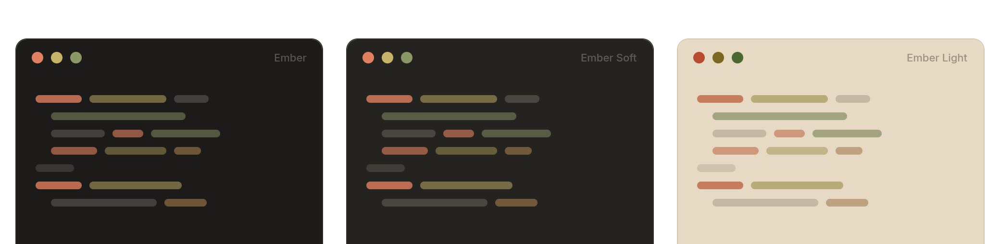

  

<h1 align="center">Ember for iTerm2</h1>

  <em>One vivid coral spark in a sea of warm graphite.</em>

  <a href="https://github.com/ember-theme/ember">Palette & Docs</a> ·
  <a href="https://embertheme.com">embertheme.com</a>

---

  

## Variants

| Variant | Background | File |
|---|---|---|
| **Ember** | `#1c1b19` — dark graphite | `ember.itermcolors` |
| **Ember Soft** | `#242320` — lifted graphite | `ember-soft.itermcolors` |
| **Ember Light** | `#e6dac4` — warm ivory | `ember-light.itermcolors` |
| **Ember Lighter** | `#e8e4de` — pale warm gray | `ember-lighter.itermcolors` |

## Install

1. Download or clone this repository.
2. Open **iTerm2 → Settings → Profiles → Colors**.
3. Open **Color Presets…**, choose **Import…**, and select one or more of the `.itermcolors` files.
4. Choose the imported Ember preset from **Color Presets…** to apply it to the current profile.

## License

MIT — Hossam Saraya
